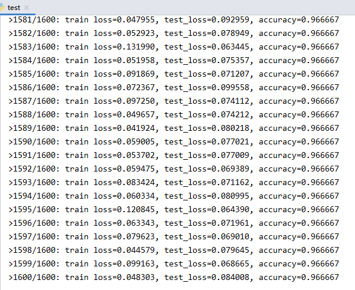
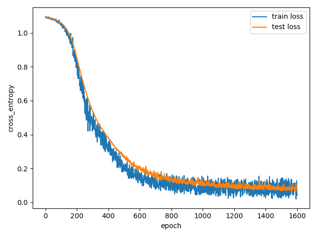

# 使用numpy简单的多层神经网络
iris多分类实例
## 获取iris数据
```python
from sklearn.datasets import load_iris
from sklearn.model_selection import train_test_split
import numpy as np

iris=load_iris()
print(iris.data.shape)
x_train,x_test,y_train,y_test=train_test_split(iris.data,iris.target,test_size=0.2,random_state=10,shuffle=True)
print(x_train.shape,x_test.shape)
print(y_test[:10])
```
## 构建数据生成器
```python
from utils import one_hot
class DataLoader:
    def __init__(self, X, y, class_num,func=None):
        self.X = X
        self.y = y
        self.class_num=class_num
        self.num_samples = X.shape[0]
        if func:  # 后处理函数
            self.X = func(self.X)

    def get_batch(self, batch_size, shuffle=True):
        indices = list(range(self.num_samples))
        if shuffle:
            np.random.shuffle(indices)
        have_train_num=0
        for i,begin in enumerate(range(0, self.num_samples - batch_size, batch_size)):
            yield self.X[indices[begin:begin + batch_size], :], one_hot(self.y[indices[begin:begin + batch_size]], self.class_num)
            have_train_num=(i+1)*batch_size
        if have_train_num<self.num_samples:
            yield self.X[indices[have_train_num:], :], one_hot(self.y[indices[have_train_num:]], self.class_num)

train_data=DataLoader(x_train,y_train,3)
test_data=DataLoader(x_test,y_test,3)
```
## 构建网络
```python
from models import NeuralNetwork
from layers import Layer

model=NeuralNetwork()
model.add_layer(Layer(4,8,'relu'))
model.add_layer(Layer(8,8,'relu'))
model.add_layer(Layer(8,3))
```
## 定义损失和优化器
```python
from optimizers import Optimizers
from loss import Loss

lr=0.01
loss=Loss(loss='cross_entropy_with_logits')
optimizer=Optimizers(optimizer='sgd',learning_rate=lr)
model.compile(loss=loss,optimizer=optimizer)
```
## 训练网络
```python
num_epochs = 1600
batch_size = 64
train_loss = []
test_loss = []
for epoch in range(num_epochs):
    for x, y in train_data.get_batch(batch_size):
        loss = model.fit(x, y)
    train_loss.append(loss)
    t_loss, n,right_num= 0., 0,0
    for x, y in test_data.get_batch(batch_size, shuffle=False):
        y_pred = model(x)
        right_num+=np.sum(np.argmax(y_pred,axis=-1)==np.argmax(y,axis=-1))
        t_loss += model.loss(y_pred, y)
        n += 1
    accuracy=right_num/test_data.num_samples
    t_loss /= n
    test_loss.append(t_loss)
    print('>%d/%d: train loss=%f, test_loss=%f, accuracy=%f' % (epoch + 1, num_epochs, loss, t_loss,accuracy))

plt.plot(train_loss)
plt.plot(test_loss)
plt.legend(['train loss', 'test loss'])
plt.xlabel('epoch')
plt.ylabel('cross_entropy')
plt.show()
```
## 训练结果



